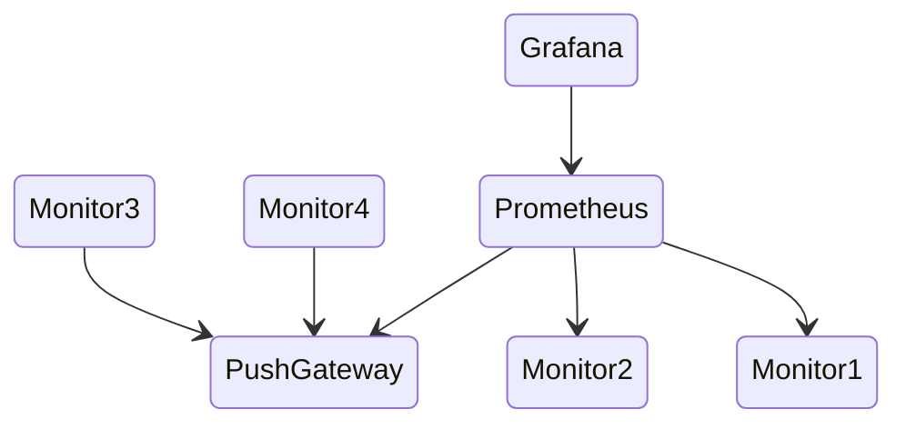

# Attestation Suite Monitor

Monitoring software is an essential component of any modern software development project. It allows developers to track the performance and behavior of their applications in real-time, making it easier to identify and troubleshoot issues as they arise. In recent years, Prometheus and Grafana have emerged as popular choices for monitoring and visualizing system metrics.

Attestation Suite monitoring utility, uses Prometheus and Grafana. This utility provides an easy and efficient way to monitor and track the progress of attestation suite tests. With Prometheus, your utility can collect and store metrics from different sources, while Grafana allows you to visualize this data in a variety of formats such as graphs, charts, and tables.

The monitoring utility provides a comprehensive view of your Attestation Suite working status, allowing you to quickly identify any potential issues. By tracking metrics such as indexer history latency, block bottom times, node system usage you can quickly identify patterns and trends that may be impacting the performance of your system. This information can then be used to optimize your systems and ensure they are running efficiently.

---
## Overview
Grafana is a tool that allows you to visualize data and create dashboards. It does this by querying Prometheus, a monitoring and alerting system, for the data it needs. Prometheus, in turn, collects metrics and time series data by sequentially querying sources for new metrics.

In addition to this, Monitor provides functionality to act as a metrics server for Prometheus, meaning that Prometheus can collect data from Monitor. Alternatively, Monitor can push metrics to a PushGateway, which Prometheus can also collect data from.




One way to collect metrics in Prometheus is by acting as a Prometheus server, used by Monitor 1 and Monitor 2, which behaves as a web server and exposes a scrape endpoint that Prometheus can scrape periodically to collect metrics. This requires the monitor to have an outside port open, allowing Prometheus to connect and collect metrics.

Another option is to use Push Gateway used by Monitor 3 and Monitor 4, which is a standalone service that allows applications to push metrics to it. Unlike Prometheus server, the monitor can be a simple HTML client that sends metrics to the Push Gateway. However, Push Gateway has a deficiency in that it retains metrics forever, and as such, metrics dropouts cannot be detected. This means that if a metric value stops being reported, Push Gateway will continue to store the last reported value indefinitely, making it difficult to detect and troubleshoot issues.  

By default the monitoring tool is configured to act as a Prometheus web server. To change the mode to Push Gateway Client apply next changes to `configs/.install/templates/monitor-config.json`:
1. Comment `"monitorServerEnabled":"true"`
2. Uncomment `"pushGatewayEnabled":"true"`

---
## Installation notes

Ports:
- Grafana is running on local port 9100 (not default)
- Prometheus is running on local port 9090 (default)
- Attestation Suite Monitor is running on local port 3010
- Push gateway is running on local port 9091 (default)

Exposed addresses:
- `https://<url_name>` points on Grafana/
- `https://<url_name>/prometheus/graph` points on Prometheus/
- `https://<url_name>/monitor` points on AS Monitor webserver (no actual data).
- `https://<url_name>/pushgateway` points on push gateway.

Other usefull links:
- `https://<url_name>/monitor/status` provides simple monitor status html
- `https://<url_name>/monitor/status/json` provides monitor status in JSON format
- `https://<url_name>/monitor/metrics` provides Prometheus monitor metrics

---
## Prometheus installation

Create `tools/prometheus` folder.

Use this `prometheus.yml` configuration.

```
global:
  scrape_interval: 15s
  scrape_timeout: 10s
  evaluation_interval: 15s
alerting:
  alertmanagers:
  - follow_redirects: true
    enable_http2: true
    scheme: http
    timeout: 10s
    api_version: v2
    static_configs:
    - targets: []
rule_files:
  - rules.yml
scrape_configs:
- job_name: attestationsuite
  honor_timestamps: true
  scrape_interval: 15s
  scrape_timeout: 10s
  metrics_path: /monitor/metrics
  scheme: https
  follow_redirects: true
  enable_http2: true
  static_configs:
  - targets:
    - <url_name>
```

Use this `run.sh` script.

```
docker run \
    -d \
    -p 9090:9090 \
    -v /home/ubuntu/tools/prometheus/:/etc/prometheus/ \
    prom/prometheus
```

To check if `Prometheus` is working, navigate to `https://<host_name>/prometheus/graph` select `Status` and choose `Targets`. There you should see one Endpoint with green status `UP`.

Monitor can be configured to provide data to Prometheus with:

- Push Gateway
- Monitor Metrics server

---
## Grafana instalation

Grafana is started from a prepared docker with command:

```
docker run -d -p 9100:3000 grafana/grafana-enterprise
```

Default login username is `admin` and password `admin`.

---
CHANGE PASSWORD ON FIRST LOGIN!


---
## Grafana setup

### Add Prometheus data source

On Home dashboard click `Data Source` ans select `Promethers` time series databases.

Change only URL to point to your hostname (i.e. https://`<host>`/prometheus).

Before exiting this page save the Prometheus `uid` from the addres URL (last part).

Click `Save & test` (at the bottom).

### Import Grafana monitoring template

To import Grafana template follow the next steps.

#### 1. Find Prometheus UID
To find Data source UID:
1. Navigate to Grafana settings (left bottom)
2. Select `Data sources`
3. Choose `Prometheus` data source
4. UID is in the URL (example: `https://<hostname>/datasources/edit/p-xsB0Y4z` UID is `p-xsB0Y4z`)

#### 2. Prepare new template
1. In Grafana template replace all `uid` values with the data source UID.

Grafana template is located here `scripts/grafana/grafana.json`.

#### 3. Create new Dashboard
1. In `Grafana/Home` create new Dashboard
2. Navigate to settings (top right).
3. Select `JSON Model` (right bottom).
4. Replace line 29 `panels:[],` with the new template.
5. Click `Save Changes` at the bottom.

---
## Push gateway

Monitor can be configured to work with push gateway or ad a Prometheus server.

*Install Push Gateway only if you intend to use it.*

Run push gateway with this command.

```
docker pull prom/pushgateway
docker run -d -p 9091:9091 prom/pushgateway
```

---
## NGINX

Here is example of nginx server configuration:

```
server {
        listen 443 ssl;
        listen [::]:443 ssl;
        server_name <url_name>;

        #Size archive        client_max_body_size 50M;

        ssl_certificate          /etc/letsencrypt/live/<url_name>/fullchain.pem;
        ssl_certificate_key      /etc/letsencrypt/live/<url_name>/privkey.pem;
        ssl_trusted_certificate  /etc/letsencrypt/live/<url_name>/chain.pem;

        location / {
           proxy_set_header Host $http_host;
           proxy_pass         http://localhost:9100;
        }

        location /prometheus/ {
           rewrite /prometheus/(.*) /$1  break;
           proxy_set_header Host $http_host;
           proxy_pass         http://localhost:9090;
        }

        location /monitor/ {
           rewrite /monitor/(.*) /$1  break;
           proxy_pass         http://localhost:3010;
        }

        location /pushgateway/ {
           rewrite /pushgateway/(.*) /$1  break;
           proxy_pass         http://localhost:9091;
        }
}

```
